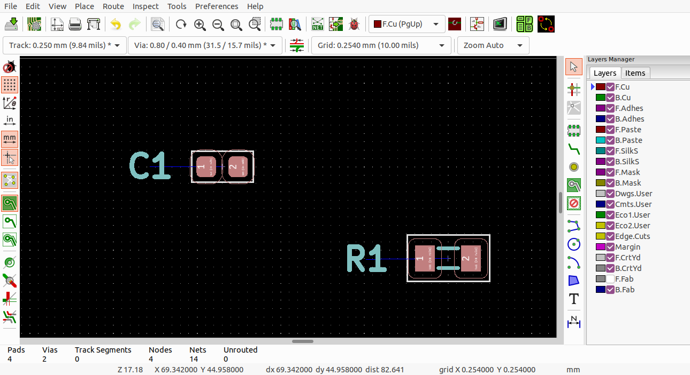
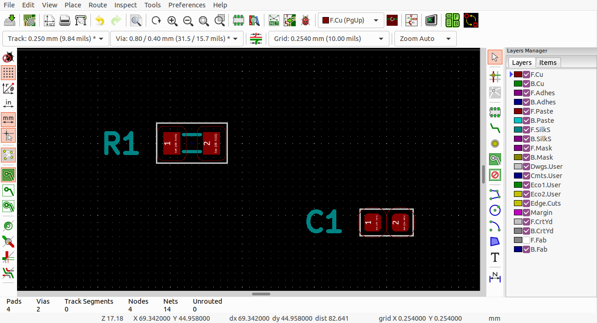

# SwapComponents KiCad plugin

## Overview
This KiCad plugin swaps in place two selected components on the PCB.

The plugin was tested with KiCad 6.0.6-3a73a75311~116~ubuntu20.04.1 on Ubuntu 20.04.

Plugin for KiCad 5 is available on the [kicad5](https://github.com/szczygiel-pawel/swap-components-kicad-plugin/tree/kicad5) branch. 

## Installation
1. Clone this repository

2. Copy the `SwapComponents` folder into the KiCad plugin directory e.g.:
``` bash
cp -r SwapComponents ~/.local/share/kicad/6.0/scripting/plugins/
```
3. Run KiCad Pcbnew

4. Select: `Tools => External Plugins... => Refresh Plugins`

>**Note:**
After the installation the `SwapComponents` plugin's icon  should be visible on the program bar. The plugin should also be available on the `Tools = > External Plugins...` list.

## Usage
1. Select to components to swap in place
   

2. Run the plugin - click on the  icon

3. The result will be
   
